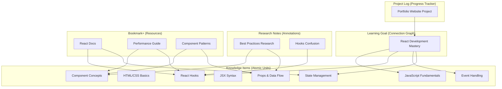

# Demo Data: React Development Mastery Learning Path

This document explains the demo data functionality in Knowledge Curator, which provides a comprehensive example of the Knowledge Item-centric architecture.

## Demo Scenario: Learning Modern Web Development

The demo data implements a complete learning scenario: **React Development Mastery Learning Path**. This scenario demonstrates how all content types work together in the new Knowledge Item-centric architecture.

### Demo Content Overview

#### 🧠 Knowledge Items (8 items)
Atomic units of knowledge that form the foundation:

1. **JavaScript Fundamentals** (factual) - Variables, functions, scope, promises
2. **HTML/CSS Basics** (factual) - Semantic markup and styling fundamentals  
3. **Component Architecture Concepts** (conceptual) - Modular UI design patterns
4. **JSX Syntax** (procedural) - JavaScript XML for React components
5. **Props and Data Flow** (procedural) - Component communication patterns
6. **State Management** (procedural) - Managing dynamic component state
7. **React Hooks** (procedural) - Modern state and lifecycle handling
8. **Event Handling** (procedural) - User interaction management

#### 🎯 Learning Goal (1 item)
Connection graph that maps relationships between Knowledge Items:

- **React Development Mastery** - Complete learning path with:
  - Starting point: JavaScript Fundamentals
  - Target items: React Hooks, Event Handling, State Management
  - 7 connections showing prerequisite relationships
  - Adaptive learning strategy with linear difficulty progression

#### 📝 Project Log (1 item)  
Progress tracker attached to the Learning Goal:

- **Personal Portfolio Website Project** - Tracks application of learned concepts
  - 4 learning sessions with progress tracking
  - 2 deliverables (basic layout completed, interactive features in progress)
  - Individual Knowledge Item progress tracking
  - Learning analytics and time distribution

#### 🔬 Research Notes (2 items)
Annotation layers on Knowledge Items:

1. **React Component Best Practices Research** - Insights on component patterns
   - Annotates: Component Concepts, Props and Data Flow
   - Type: Insight with high confidence
   - Suggests Knowledge Item updates

2. **useEffect Dependencies Confusion** - Personal learning challenges
   - Annotates: React Hooks
   - Type: Question with low confidence (learning in progress)
   - Documents specific difficulties with dependency arrays

#### 🔖 Bookmark+ Resources (3 items)
External resources connected to Knowledge Items:

1. **React Official Documentation - Hooks** - Connected to React Hooks, State Management
2. **React Performance Best Practices** - Connected to Component Concepts, React Hooks  
3. **React Component Patterns Guide** - Connected to Component Concepts, Props and Data Flow

## Using Demo Data

### Quick Start (Default)

Demo data is **enabled by default** for the best first-time experience:

```bash
# Start with demo data (default behavior)
make start
# or
make quick-start
```

This creates a complete learning scenario ready for exploration and demonstration.

### Start Without Demo Data

If you want a clean environment:

```bash
# Start without demo data
make quick-start-clean
```

### Backend-Only Demo Data

For backend-only development:

```bash
# Create demo data in existing backend
make backend-create-demo-data

# Start backend with fresh demo data
make backend-start-with-demo
```

### Environment Variables

Control demo data creation with environment variables:

```bash
# Enable demo data (default)
CREATE_DEMO_DATA=1 make quick-start

# Disable demo data
CREATE_DEMO_DATA=0 make quick-start

# Force recreate site with demo data
DELETE_EXISTING=1 CREATE_DEMO_DATA=1 make quick-start
```

## Demo Data Architecture

The demo data demonstrates the **Knowledge Item-centric architecture**:



## Demo Flow for Presentations

### 5-Minute Demo Script

1. **Knowledge Items Foundation** (1 min)
   - Show "JavaScript Fundamentals" with rich metadata
   - Highlight atomic concepts, mastery threshold, difficulty level
   - Demonstrate prerequisite/enables relationships

2. **Learning Goal as Connection Graph** (1.5 min)  
   - Show "React Development Mastery" Learning Goal
   - Demonstrate knowledge_item_connections graph
   - Show prerequisite chain: JS → JSX → Props → State → Hooks

3. **Project Log Progress Tracking** (1.5 min)
   - Show "Portfolio Website Project" attached to Learning Goal
   - Demonstrate learning sessions with Knowledge Item focus
   - Show progress aggregation and learning analytics

4. **Research Notes Annotation** (1 min)
   - Show "Hooks Dependencies Confusion" annotating React Hooks
   - Demonstrate annotation types and confidence levels
   - Show suggested Knowledge Item updates

### 10-Minute Comprehensive Demo

Extend the 5-minute demo with:

5. **Bookmark+ Resource Connections** (2 min)
   - Show React documentation connected to multiple Knowledge Items
   - Demonstrate resource quality tracking and reading status
   - Show how external resources enhance learning

6. **System Integration** (3 min)
   - Demonstrate workflow transitions affecting multiple content types
   - Show vector indexing prioritizing Knowledge Items
   - Display the complete interconnected ecosystem

## Demo Data Benefits

### For Development
- **Immediate Context**: Rich content for testing UI/UX improvements
- **Relationship Testing**: Complex connections for graph algorithm testing  
- **Workflow Validation**: All content types in various states for workflow testing
- **Performance Testing**: Realistic content volume for optimization work

### For Stakeholder Demos  
- **Concrete Scenario**: Relatable learning context (React development)
- **Architecture Showcase**: Clear demonstration of Knowledge Item centricity
- **User Journey**: Complete learning path from basics to advanced concepts
- **Integration Example**: All content types working together effectively

### For User Onboarding
- **Learning by Example**: Users can explore the system with meaningful content
- **Best Practices**: Demonstrates proper content structure and relationships
- **Feature Discovery**: Users can see all capabilities in realistic context
- **Confidence Building**: Success with demo scenario builds user confidence

## Extending Demo Data

### Adding New Scenarios

To create additional demo scenarios:

1. Copy `knowledge-curator/backend/src/knowledge/curator/scripts/create_demo_data.py`
2. Modify the data structures for your scenario
3. Update vocabulary values to match available options
4. Test with `make backend-create-demo-data`

### Customizing for Your Domain

Adapt the demo data for your specific domain:

1. Replace React concepts with domain-specific Knowledge Items
2. Update Learning Goals to reflect domain learning paths  
3. Modify Project Logs for domain-relevant projects
4. Add domain-specific Research Notes and Bookmark+ resources

The demo data framework provides a solid foundation for any knowledge domain while showcasing the system's architectural capabilities. 